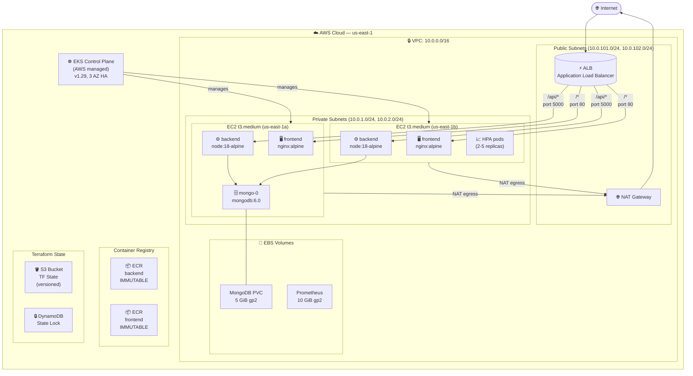
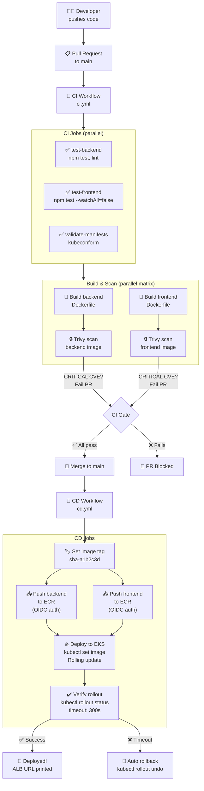
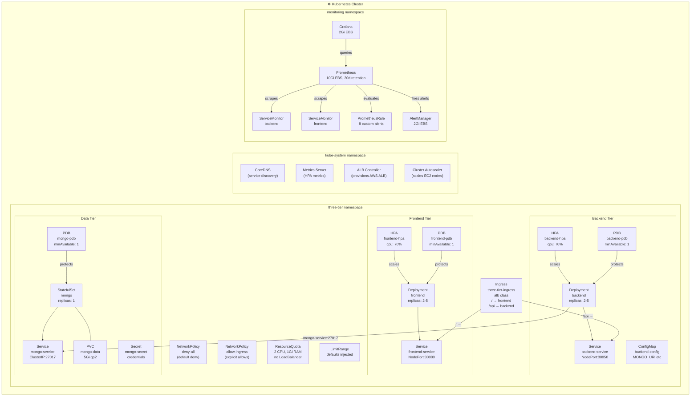
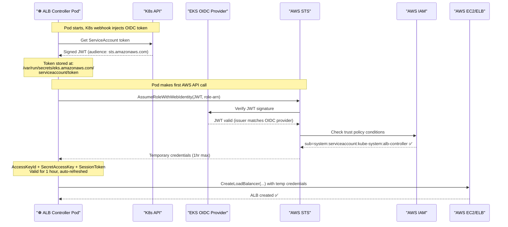
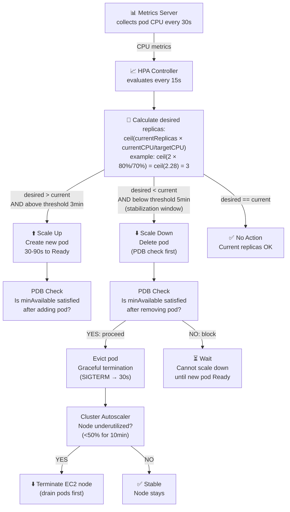

# Architecture Diagrams (Mermaid)

> Copy any diagram block into [mermaid.live](https://mermaid.live) to render it.
> These are also auto-rendered in GitHub Markdown.

---

## Diagram 1 — AWS Infrastructure Overview

---

## Diagram 2 — CI/CD Pipeline Flow

---

## Diagram 3 — Kubernetes Namespace Topology

---

## Diagram 4 — IRSA Authentication Flow

---

## Diagram 5 — HPA Scaling Decision Flow

